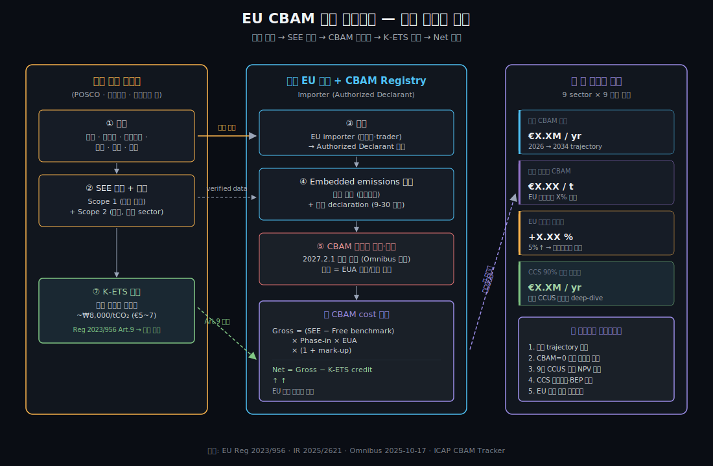

# 📘 EU CBAM 영향 계산기 — 사용자 매뉴얼

> 본 매뉴얼은 EU 탄소국경조정제도(CBAM)·EU ETS·CCS 시장에 어느 정도 익숙하신 분(산업 분석가, IR/ESG 담당자, 컨설턴트, 기술사업화 담당자)을 위한 실무 가이드입니다. CBAM이 처음이신 분은 1장의 메커니즘 다이어그램부터 보시고, 익숙하신 분은 3장 시나리오 흐름부터 시작해도 됩니다.

---

## 1. CBAM이 무엇이고, 어떻게 작동하는가

### 1.1 한 줄 요약
> **EU가 수입하는 6개 탄소집약 제품**(철강·시멘트·알루미늄·비료·수소·전력)의 **내재 탄소량(SEE)에 대해, EU 내 생산자가 ETS에서 지불하는 수준의 carbon price를 부과**하는 제도. 2026년 1월 본격 시행, 2034년 100% 부과 도달.

### 1.2 작동 메커니즘 다이어그램



> 다이어그램이 보이지 않으면 [`cbam_mechanism.svg`](./cbam_mechanism.svg)를 직접 열어보세요.

**핵심 흐름** (5단계):
1. **🇰🇷 한국 수출자** (POSCO·현대제철·노벨리스 등)가 제품 생산 + SEE 측정 + verified data 준비
2. **EU importer (Authorized Declarant)**가 분기 보고 + 연간 declaration 제출
3. **CBAM Registry**가 (SEE − Free benchmark) × Phase-in × EUA × (1 + mark-up) 계산
4. **K-ETS 차감** (Art.9): 한국에서 이미 지불한 carbon price를 차감
5. **Net CBAM cost** 확정 → 인증서 구매·제출

**수식 한 줄**:
```
Gross = (SEE − Free benchmark) × Phase-in × EUA × (1 + mark-up)
Net   = Gross − K-ETS credit (verified)
연간 부담 = Net × EU 수출량
```

### 1.3 Phase-in 일정 (단계적 부과율)

| 연도 | CBAM 부과율 | EU ETS Free Allocation |
|---|---|---|
| 2023.10 ~ 2025 | **0% (보고만)** | 100% |
| **2026** ⭐ | **2.5%** | 97.5% |
| 2027 | 5.0% | 95.0% |
| 2028 | 10.0% | 90.0% |
| 2029 | 22.5% | 77.5% |
| **2030** ⭐ 변곡점 | **48.5%** | 51.5% |
| 2031 | 61.0% | 39.0% |
| 2032 | 73.5% | 26.5% |
| 2033 | 86.0% | 14.0% |
| **2034** ⭐ | **100%** | **0%** |

> 💡 **2030년이 변곡점**. 2029→2030 사이 부과율이 22.5% → 48.5%로 2배 이상 급증. 한국 기업의 본격적 충격은 이 시점부터.

### 1.4 6개 sector + EU benchmark (단위: tCO₂/t product)

| Sector | EU Free Benchmark | 한국 평균 SEE | Gap (Free benchmark 대비 초과) |
|---|---|---|---|
| 철강 BF-BOF (HRC) | 1.370 | 2.127 (POSCO) | **+0.757** |
| 철강 DRI-EAF | 0.481 | 0.95 | +0.469 |
| 철강 Scrap-EAF | 0.072 | 0.40 | +0.328 |
| 시멘트 (clinker) | 0.693 | 0.85 | +0.157 |
| 알루미늄 (primary) | 1.514 | 16.0 (수입 ingot) | **+14.486** |
| 비료 NH₃ | 1.619 | 2.0 | +0.381 |
| 수소 (gray) | 8.85 | 11.0 | +2.15 |
| 전력 (Grid) | 0.230 | 0.443 (한국) | +0.213 |

> 💡 **알루미늄의 gap이 압도적으로 큰 이유**: 한국에는 primary smelter가 없고, ingot은 중국·러시아 등에서 수입합니다. CBAM은 수입 ingot의 **원산지 SEE**를 따지므로, 한국 alu 가공업체는 사실상 중국 grid (~18 tCO₂/t)에 묶임.

### 1.5 2025년 Omnibus 단순화 변경사항 (반영됨)

| 항목 | 변경 전 | 변경 후 (2025-10-17 OJ) |
|---|---|---|
| 소액 면제 | €150 가치 | **연 50톤** (mass-based, H₂·전력 제외) |
| 인증서 판매 개시 | 2026-01-01 | **2027-02-01** (2026 분 소급 정산) |
| 연간 declaration 마감 | 5-31 | **9-30** |
| 분기 holding 최소 | 80% | **50%** |
| Authorized declarant | 사전 등록 | 2026-03-31까지 grace period |

본 도구는 위 변경사항을 모두 반영합니다.

---

## 2. 도구의 9개 SEE Sector × 9개 시나리오 프리셋

### 2.1 9개 sector 라이브러리

도구는 EU CBAM 6개 공식 sector + 철강 3 공정 분류(BF-BOF / DRI-EAF / Scrap-EAF) + 수소 2 공정(Gray / Blue+CCS) = **9개 sector**를 지원합니다.

### 2.2 9개 한국 기업 프리셋 (+ 1개 EU 참조)

| # | 프리셋 | Sector | 핵심 수치 |
|---|---|---|---|
| 1 | 🇰🇷 POSCO (BF-BOF) | 철강 | 75 Mt/yr, EU 수출 5%, SEE 2.127 |
| 2 | 🇰🇷 현대제철 (BF + EAF mix) | 철강 BF | 17 Mt/yr (BF 70%) |
| 3 | 🇰🇷 현대제철 (Pure Scrap-EAF) | 철강 EAF | 5 Mt/yr |
| 4 | 🇰🇷 쌍용·한일시멘트 | 시멘트 | 10 Mt/yr clinker |
| 5 | 🇰🇷 노벨리스 코리아 | 알루미늄 | 1.5 Mt/yr, 재활용 60% |
| 6 | 🇰🇷 한화솔루션 | 비료 NH₃ | 200 kt/yr |
| 7 | 🇰🇷 SK E&S (Gray H₂) | 수소 | 100 kt/yr SMR |
| 8 | 🇰🇷 SK E&S + CCS (Blue H₂) | 수소 | 100 kt/yr Blue |
| 9 | 🇸🇪 H2 Green Steel (참조) | 철강 DRI-EAF | 5 Mt/yr, SEE 0.40 |
| ✏️ | Custom | (선택) | 사용자 입력 |

---

## 3. 시나리오 흐름 — 분석가의 5단계 워크플로우

### Step 1. **사이드바에서 시나리오 선택** (10초)

가장 흔한 분석 시작점:
- **"우리 회사가 POSCO 정도다"** → 프리셋 #1 선택
- **"우리는 ingot 수입해 가공"** → 프리셋 #5 (노벨리스)
- **"내가 모르는 회사"** → ✏️ Custom + 자체 데이터 입력

### Step 2. **사이드바에서 핵심 변수 4가지 조정**

| 변수 | 조정 가이드 |
|---|---|
| **EU 수출 비중 (%)** | 본인 회사의 실제 EU 수출 비율. 시장조사 보고서·관세청 통계 활용. |
| **Verified SEE** | 자사 ESG 보고서 기준. POSCO 2.127, 현대제철 EAF 0.40 등 검증된 값. |
| **EUA 가격 (€/tCO₂)** | 자동 fetch (주1회 갱신). 수동 변경 시 보수적 €100, 낙관적 €60. |
| **분석 연도 (2026~2034)** | **2026 (현재 충격)** vs **2030 (변곡점)** vs **2034 (완전 시행)** 3개 비교 권장. |

### Step 3. **K-ETS 차감 활성화 (한국 할당대상업체만)**

> 💡 **한국 사용자의 핵심 차별화 포인트**

본 도구가 일반 EU calculator와 다른 점:

```
□ K-ETS 지불액 차감 (Reg 2023/956 Art.9)
   K-ETS 가격: [8,000] ₩/tCO₂
   Verified 차감 비율: [50]%
```

- **체크 시 → 한국 K-ETS에서 이미 지불한 carbon price를 EU CBAM에서 차감**
- 보수적 시나리오: 차감 50% (협상 진행 중 가정)
- 낙관적 시나리오: 차감 100% (한·EU MRV 호환 협정 체결 가정)
- 비관적 시나리오: 차감 0% (차감 거부 가정)

K-ETS 가격 ~₩8,000/tCO₂ × SEE 2.127 = ~₩17,000/t product = €11/t를 차감 가능. POSCO처럼 SEE 큰 기업일수록 효과 큼.

### Step 4. **메인 화면에서 4대 KPI 즉시 확인**

| KPI | 의미 | 해석 가이드 |
|---|---|---|
| 연간 CBAM 부담 | 현재 분석 연도의 net 비용 | 매출 대비 비중 ↗ → 가격 인상 압력 |
| 단위 제품당 CBAM | €/t product | EU 시장가의 X% 추가 비용 |
| EU 수출가 인상률 | 현재 EU 수출가 대비 % | 5% 넘으면 가격경쟁력 위협 |
| CCS 90% 회피 가능액 | CCS 도입 시 회피되는 부담 | 회피액 vs CCS 비용 비교 출발점 |

### Step 5. **탭별 deep-dive 순서**

1. **탭 ①**: 9개 sector 비교로 본인 sector 위치 파악
2. **탭 ②**: 본인 sector의 SEE 스펙트럼 (default/한국/benchmark)
3. **탭 ④ 4-A**: "CBAM=0 만들려면 얼마 감축 필요한가?" 역산
4. **탭 ④ 4-B**: 7가지 감축 수단 비교 (CCS, DRI-H₂ Gray/Blue/Green, EAF 전환, RE100, Bio-CCS, 효율)
5. **탭 ④ 4-C**: 자매 CCUS 도구의 9개 기술 단년도 BEP
6. **탭 ④ 4-D** ⭐: NPV 기반 동태 BEP (가동개시·ramping·할인율) — **재무 의사결정의 핵심**
7. **탭 ⑥**: 2026~2034 연도별 부담 trajectory
8. **탭 ⑩**: EU CBAM 최신 공지 (월 1회 자동 fetch)

---

## 4. NPV 기반 동태 BEP 분석 (탭 ④ 4-D) — 가장 중요한 기능

### 4.1 단년도 정태 vs 동태 NPV의 차이

**문제**: 기존 BEP 분석(4-C)은 "분석 연도에 CCS가 즉시 100% 가동 중"을 가정. 그러나 현실은:
- FID → 건설 → 가동까지 **4~6년** (POSCO·Norcem 사례)
- 가동 후 1~2년차 **70~85% capture** (운영 학습 곡선)
- CCS CAPEX는 **가동 시점 일시 지출** (1조원+ 규모)

**해결**: 4-D는 다음을 모두 반영:
- **가동 개시 연도** 입력 (default 2030)
- **할인율** 입력 (default 8%, 한국 산업 WACC)
- **수명** 입력 (default 20년)
- **Ramping curve**: 1년차 70%, 2년차 85%, 3년차+ 100%

### 4.2 NPV 결과 해석

```
NPV CAPEX (총)        ← 일시 지출
NPV 회피액 (수명누적)  ← 가동 후 매년 회피되는 CBAM의 할인 합계
NPV 비용 (CAPEX+OPEX) ← 위 두 가지 합산
NPV 순익              ← 회피액 - 비용
BEP year              ← 누적 회피액이 누적 비용 초과하는 연도
```

**판단 기준**:
- **NPV 순익 > 0 → CCS 도입 권장** (€단위로 정량 평가)
- **BEP year ≤ 가동개시+10년 → 빠른 회수, 강력 추천**
- **BEP year > 가동개시+15년 → 정책 보조 필요**

### 4.3 시나리오 비교 권장

| 시나리오 | 가동개시 | 할인율 | 의미 |
|---|---|---|---|
| **Optimistic** | 2028 | 6% | 정책 강력 지원 + 저렴한 자본 |
| **Base** | 2030 | 8% | 한국 산업 평균 (POSCO·Norcem) |
| **Pessimistic** | 2032 | 10% | 지연·고금리 환경 |

3개 모두 돌려서 **NPV 순익이 모두 양수면** 안전한 투자. 1~2개만 양수면 정책 리스크에 따라 갈림.

---

## 5. 자매 CCUS 도구와의 연계

### 5.1 자매 도구

🌫️ **[CCUS 기술 벤치마크 라이브 앱 ↗](https://ccusamineanalysis-9z3cxdmxmd3muuepqlhaqb.streamlit.app/)**

한국·미국·EU의 9개 CCUS 흡수제·공정 기술의 COCA·SPECCA·CAPEX 비교:
1. MEA 30wt% (1세대 baseline)
2. MHI KS-21™ (Petra Nova 후속)
3. Shell Cansolv DC-103 (Boundary Dam)
4. Aker S26 (Norcem Brevik)
5. KIERSOL (KIER 한국)
6. Chilled Ammonia CAP (NETL B12C)
7. Biphasic DMX™ (TotalEnergies)
8. Solid Sorbent TSA (DOE)
9. Calcium Looping CaL

### 5.2 본 도구의 활용 흐름

```
[CBAM 도구]                    [CCUS 도구]
   │                               │
   │ 1. 탭 ④ 4-A에서 필요 감축율 산출  │
   │    ex) POSCO -36% 필요          │
   │                               │
   │ 2. 탭 ④ 4-B에서 가능 옵션 파악     │
   │    "CCS 90%면 충분"              │
   │                               │
   │ 3. 탭 ④ 4-C/4-D에서             │
   │    9개 기술 BEP 비교            │
   │                               │
   │ 4. 가장 적합한 기술 선택          │
   │    ex) Calcium Looping           │
   │                               │
   ├──── 자매 도구 link ──────────►  │ 5. 해당 기술의
   │                               │    SRD·We·CAPEX·운영조건
   │                               │    상세 시뮬레이션
   │                               │
   │                               │ 6. 자매 도구의 결과로
   │                               │    실제 프로젝트 설계
   ▼                               ▼
```

---

## 6. 자주 묻는 질문 (FAQ)

### Q1. 도구가 보여주는 €71/t (POSCO 2026)는 EU 보고서와 다른데?

본 도구는 **EU 공식 수식** `(SEE − benchmark) × phase-in × EUA`을 사용합니다. 일부 보고서는:
- (a) Phase-in 100% 기준으로 환산 (2034 도달 시점)
- (b) Free benchmark 차감 없이 전체 SEE × EUA

이렇게 다른 방법론을 쓰는데, **재무 계획에는 본 도구의 (c) EU 공식 산법이 정확**합니다.

### Q2. 우리 회사 알루미늄 SEE가 8인데 도구는 16으로 박혀있어요

알루미늄 sector default(16)는 **"한국이 수입하는 ingot의 가중평균"** 기준 (중국 비중 큼). 본인 회사가:
- **재활용 비중 높음** → 사이드바 "Verified 자체 데이터" 선택 후 직접 입력
- **인증된 청정 ingot 사용** → 사이드바 "Scope 2 입력"에서 grid factor 직접 입력

### Q3. K-ETS 차감 50%로 하라는 근거는?

2026년 1월 시점에서 한·EU MRV 호환 협정이 미체결. **차감은 EU 위원회가 verified만 인정**하므로, 협상이 진행 중인 동안은 보수적으로 50% 정도 가정. 협상 결과에 따라 0%(거부)~100%(완전 인정)까지 변동.

### Q4. 도구의 EU 수출 평균가($700/t 등)는 뭘 기준으로?

LME(알루미늄), SBB(철강), CemNet(시멘트) 같은 **시장 가격 평균**을 default로 두었지만, **본인의 실제 EU 수출가로 사이드바에서 조정 가능**합니다. 회사 IR 자료의 평균 단가가 가장 정확합니다.

### Q5. 2030년 변곡점 의미를 어떻게 활용?

분석 연도를 2026/2030/2034로 바꿔가며 트라젝토리를 만들어보세요:
- **2026**: 거의 무시할 수준의 부담 (warming-up)
- **2030**: 부담의 50% 도달 → **CCS 가동개시 목표 연도**
- **2034**: 완전 시행 → **CCS 의무화 시점**

CCS 프로젝트의 **2030 가동 목표**가 합리적인 이유 — 그래야 phase-in 변곡점에 맞춰 회피 가능.

### Q6. CBAM 면제 50t 임계치는 우리 회사에 적용되나요?

연 50톤 이하 수입자에만 적용. **POSCO·현대제철·노벨리스 같은 대형 수출사는 제외 안 됨**. 50톤은 사실상 SME(중소 trader) 보호용. H₂·전력은 50톤 면제에서 제외.

### Q7. downstream 제품(가공된 부품 등)도 부과 받나요?

현재(2026.1) 시점에서 **Phase 1 sector(원자재)만 부과**. 그러나 EU 위원회는 **2025-12-17 발표**에서 가공된 철강·알루미늄 제품 확장 제안 — **2028년 시행 목표**. 본 도구는 Phase 1만 다루지만, 도구의 ⑩ 뉴스 탭에서 확장 진행상황 자동 추적.

---

## 7. 한계와 가정

본 도구의 추정값이므로 다음 한계 인지:

1. **SEE는 verified 우선** — 2024.7 이후 default 사용 시 mark-up
2. **Indirect emissions** — 시멘트·비료만 indirect 포함 (CBAM 규정), 나머지는 direct만
3. **EUA 가격 변동성** — 매주 평균 변동, 연간 평균 €60~85 변동성 큼
4. **Free benchmark 갱신** — 2025년 IR 2025/2621 기준
5. **K-ETS 차감 비율** — 협상 결과에 따라 0~100% 변동
6. **CCS ramping curve** — 사례별 학습 곡선 다름 (default 70/85/100%)
7. **CAPEX 일시 집중** — 단순화 (실제는 EPC 기간 분할)
8. **물가상승률 미반영** — 모든 가격은 실질(real) 기준

업무용 분석 시:
- 본인 회사의 **verified ESG 데이터** 우선 사용
- **EU 협상 진행상황** 추적 (탭 ⑩ 뉴스)
- **외부 검증** (회계법인·컨설팅펌 검토) 권장

---

## 8. 매뉴얼 요약 — 한 페이지

```
┌─────────────────────────────────────────────────────────────┐
│  EU CBAM 영향 계산기 — 30초 가이드                          │
├─────────────────────────────────────────────────────────────┤
│                                                             │
│  Step 1.  사이드바 → 프리셋 선택                            │
│  Step 2.  Verified SEE / 수출비중 / EUA 가격 조정           │
│  Step 3.  K-ETS 차감 활성화 (한국 사업자만)                 │
│  Step 4.  분석 연도 선택 (2026/2030/2034 권장)              │
│                                                             │
│  Step 5.  메인 4대 KPI 확인                                 │
│  Step 6.  탭 ④ 4-D NPV 분석으로 CCS 의사결정                │
│  Step 7.  탭 ⑩ 뉴스로 최신 EU 정책 동향 모니터링            │
│                                                             │
│  💡 한국 사용자 핵심 차별점:                               │
│     - K-ETS 차감 메커니즘 (Reg 2023/956 Art.9)             │
│     - 9개 한국 기업 프리셋                                  │
│     - 자매 CCUS 도구 9개 기술 BEP 연계                     │
│     - EU CBAM 공지 자동 fetch (월 1회)                     │
│                                                             │
└─────────────────────────────────────────────────────────────┘
```

---

## 📚 더 알아보기

- 본 도구 GitHub: <https://github.com/cafeon90-oss/CBAM_calculator>
- 자매 CCUS 도구: <https://ccusamineanalysis-9z3cxdmxmd3muuepqlhaqb.streamlit.app/>
- EU CBAM 공식: <https://taxation-customs.ec.europa.eu/carbon-border-adjustment-mechanism_en>
- 작성자 블로그: <https://cdrmaster.tistory.com/>

문의·기여 제안: cafeon90@gmail.com

© 2026 송봉관 / Song BK · MIT License
